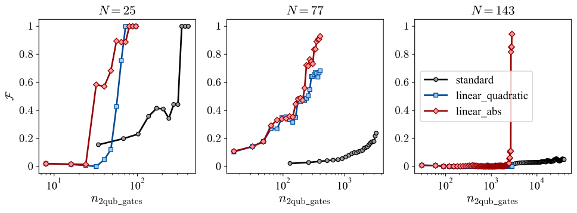

# Enhanced Digitized Adiabatic Factorization Algorithm

### Abstract

Integer factorization is a computational problem of fundamental importance in cybersecurity and secure communications, as its difficulty form the basis of modern public-key cryptography. While Shor's algorithm can solve this problem efficiently on a universal quantum computer, near-term devices require alternative approaches. The Adiabatic Factorization Algorithm and its digitized counterparts offer a promising NISQ-era pathway but suffer from high-order many-body interactions that are difficult to implement. **In this work, we propose a modified QAOA-based factorization protocol that simplifies the interacting Hamiltonian to include only two-body terms, significantly reducing its experimental complexity. Numerical simulations show that this method achieves comparable or higher fidelities than the standard protocol, while requiring fewer quantum resources and converging more rapidly for problem instances up to eight qubits.** We analyze the characteristic fidelity behavior introduced by the Hamiltonian modification. Additionally, we report on simulations with alternative cost-function definitions that frequently yielded improved performance.

### Main results

**Fidelity vs. # two-qubit gates**

We compare protocols using the number of two-qubit gates as the resource metric. In these terms, the advantage of the linear protocols becomes clear: they achieve significantly higher fidelities while requiring far fewer quantum operations.

### Repo organization

This repository contains two main folders:
* ***qaoa_factorization***:
    * qaoa_solver.py: Class that implements the core logic for the QAOA factorization simulations.
    * main.py: Contains the *main* function, used for easily running a problem instance.
    * experiments folder: Contains configuration files for each problem instance and setup combination and simulation results.
    * notebooks folder:
        * run_simulator.ipynb shows the basic usage of the QAOASolver class.
        * results.ipynb and paper.ipynb contain the code to generate visualization for Master's thesis and paper, respectively.

* ***thesis***: LaTeX project for the Master's thesis.

Have a look at the Master's thesis manuscript in the following [link](thesis/Thesis.pdf).